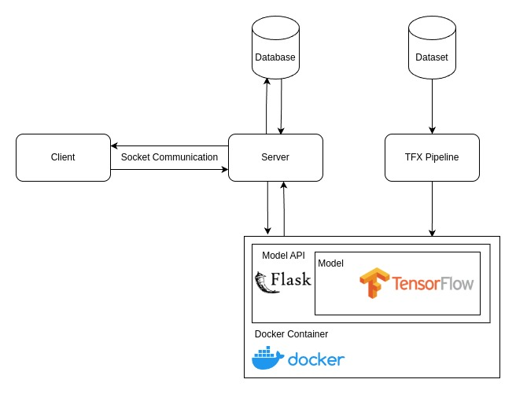

# Chatbot Layanan PSTI

Proyek ini adalah implementasi chatbot untuk layanan informasi PSTI, dikembangkan sebagai bagian dari mata kuliah **Pemrograman Internet**. Proyek ini memanfaatkan **Java** untuk aplikasi utama, **Flask** untuk backend server yang melayani model machine learning, serta **Docker** untuk deployment model. Model machine learning dikembangkan menggunakan **TensorFlow** dan dikelola melalui pipeline **TensorFlow Extended (TFX)**. Sistem komunikasi aplikasi menerapkan **Socket Programming**, di mana server bertanggung jawab untuk menghubungkan client dengan model.

---

## Fitur Utama
- **Chatbot Interaktif**: Memberikan layanan informasi mata kuliah dan informasi umum kampus.
- **Pipeline Machine Learning dengan TFX**:
  - Preprocessing data menggunakan `Transform`.
  - Tuning model menggunakan `Tuner`.
  - Training model menggunakan `Trainer`.
  - Evaluasi model menggunakan `Evaluator`.
  - Deployment model ke Flask API menggunakan `Pusher`.
- **Socket-Based Communication**: 
  - Server berbasis Java untuk menghubungkan client dengan backend model.
  - Client dapat mengirim pertanyaan yang diteruskan ke server untuk diproses oleh model chatbot.
- **Deployment Berbasis Docker**:
  - Backend model dan Flask API berjalan di container Docker.

---

## Arsitektur Proyek
### Arsitektur Pipeline Machine Learning

### Arsitektur Aplikasi

